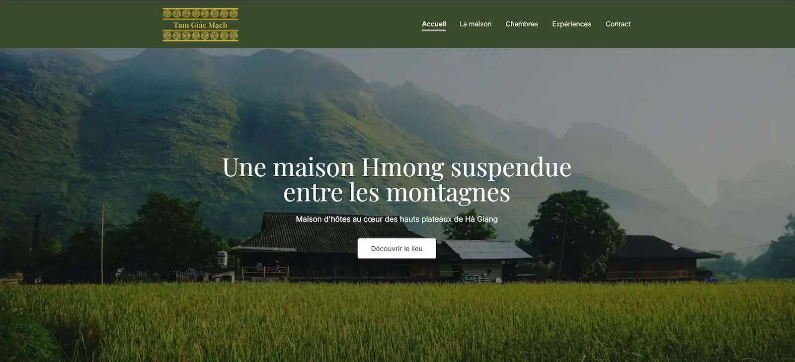
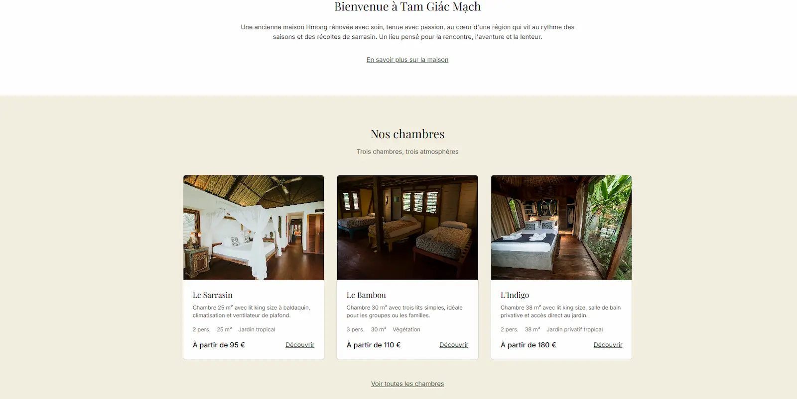
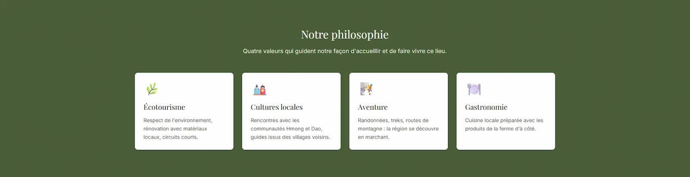
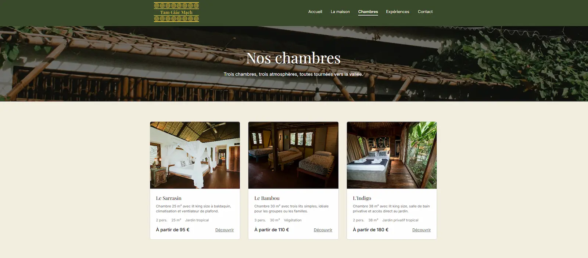
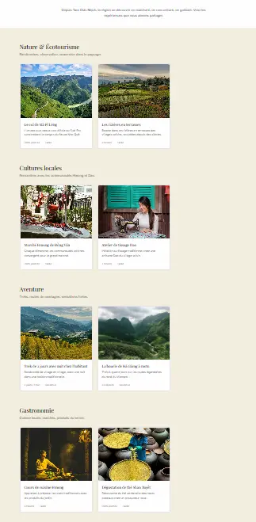
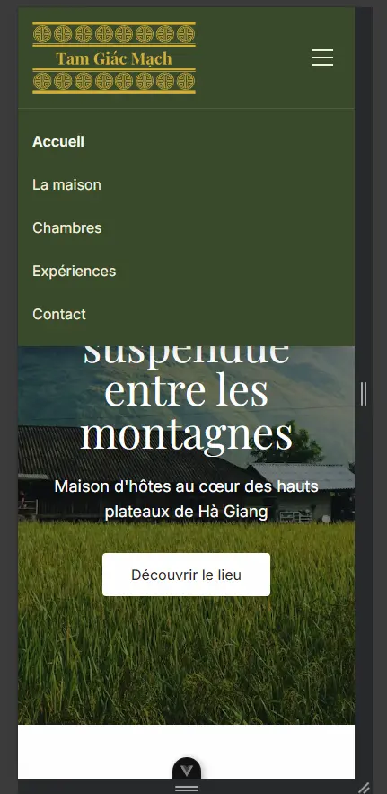

# Tam Giác Mạch

> Site vitrine d'une maison d'hôtes fictive dans les hauts plateaux de Hà Giang, au nord du Vietnam. Projet personnel d'apprentissage de Vue.js 3.

🇫🇷 Français · [🇬🇧 English version](./README.en.md)

---

## Aperçu



Tam Giác Mạch (« sarrasin » en vietnamien) est une maison d'hôtes imaginaire installée dans une ancienne demeure Hmong rénovée. Le site présente la maison, ses trois chambres, les expériences proposées dans la région, et permet aux visiteurs d'entrer en contact.

**🔗 Démo en ligne** : [tam-giac-mach.vercel.app](https://tam-giac-mach.vercel.app/)

---

## Fonctionnalités

- **6 pages complètes** avec contenu narratif : accueil, la maison, liste des chambres, détail d'une chambre, expériences, contact
- **Routage dynamique** pour les chambres (`/chambres/le-sarrasin`, `/chambres/le-bambou`, `/chambres/l-indigo`)
- **Formulaire de contact** avec validation côté client
- **Modal d'expériences** avec fondu d'apparition
- **Menu mobile responsive** (burger avec fermeture auto à la navigation)
- **Animations au scroll** via l'API Intersection Observer
- **Identité visuelle complète** : typographie custom, 3 palettes de couleurs (sage, bamboo, driedbamboo)
- **Images optimisées** (WebP, lazy loading, priorisation du hero)
- **Métadonnées SEO et Open Graph** pour le partage social
- **Page 404 narrative** qui conserve l'univers du site

---

## Stack technique

| Domaine     | Technologie                                  |
| ----------- | -------------------------------------------- |
| Framework   | Vue.js 3 (Composition API, `<script setup>`) |
| Build       | Vite                                         |
| Routage     | Vue Router                                   |
| Styling     | Tailwind CSS v4 (directive `@theme`)         |
| Typographie | Playfair Display + Inter (Google Fonts)      |
| Versionning | Git + GitHub (workflow feature branch + PR)  |
| Qualité     | ESLint + Prettier                            |

---

## Captures d'écran

### Accueil — Section Nos chambres



### La maison — Section Philosophie



### Chambres — Vue d'ensemble



### Expériences — Les 4 catégories



### Menu mobile



---

## Installation

```bash
# Cloner le dépôt
git clone https://github.com/alexwebdevpro-coder/tam-giac-mach.git
cd tam-giac-mach

# Installer les dépendances
npm install

# Lancer le serveur de développement
npm run dev

# Construire pour la production
npm run build
```

Le serveur de développement démarre sur `http://localhost:5173`.

---

## Structure du projet

```
tam-giac-mach/
├── docs/
│ └── screenshots/ # Captures pour ce README
├── public/
│ └── images/
│ ├── brand/ # Logo et favicon
│ ├── rooms/ # Photos des 3 chambres
│ ├── experiences/ # Photos des 8 expériences
│ └── general/ # Photos d'ambiance pour les sections
├── src/
│ ├── assets/
│ │ └── main.css # Tailwind + @theme (fonts + palettes custom)
│ ├── components/
│ │ ├── layout/ # AppHeader, AppFooter
│ │ ├── ui/ # PageHero, DarkCallToAction, FadeIn
│ │ ├── home/ # ValueCard
│ │ ├── rooms/ # RoomCard
│ │ ├── experiences/ # ExperienceCard, ExperienceModal, CategorySection
│ │ └── contact/ # ContactForm
│ ├── views/ # Les 6 pages + NotFoundView
│ ├── data/ # rooms.js, experiences.js (données statiques)
│ ├── router/ # Configuration Vue Router
│ ├── App.vue
│ └── main.js
├── index.html
└── package.json
```

---

## Apprentissages

Ce projet m'a permis d'approfondir plusieurs concepts clés du développement front-end moderne :

### Vue.js et Composition API

- Maîtrise de `ref`, `computed`, `defineProps`, `defineEmits`
- Pattern « props down, events up » pour la communication parent-enfant
- Utilisation des lifecycle hooks (`onMounted`, `onBeforeUnmount`)
- Slots pour créer des composants wrappers réutilisables

### Vue Router

- Routes nommées et paramètres dynamiques
- Gestion de la route catch-all pour la 404
- Classes automatiques `router-link-active` pour le style conditionnel

### CSS et Tailwind v4

- Palettes de couleurs customisées via la directive `@theme`
- Pseudo-éléments pour des animations avancées (soulignement qui s'étend depuis le centre)
- Technique du « ghost element » avec `attr()` pour réserver de l'espace
- Responsive avec les breakpoints Tailwind (`md:`, `lg:`)

### API Web natives

- `IntersectionObserver` pour les animations au scroll sans librairie
- `loading="lazy"` et `fetchpriority="high"` pour l'optimisation des images
- Respect de `prefers-reduced-motion` pour l'accessibilité

### Performance

- Compression et redimensionnement des images (Squoosh)
- Réduction du poids total de la page de **9.1 MB à 4.6 MB (-49%)**
- Temps de chargement amélioré de **782 ms à 549 ms (-30%)**

### Workflow Git professionnel

- Utilisation systématique de branches par feature (`feat/`, `perf/`, `docs/`)
- Commits Conventional (préfixes `feat:`, `fix:`, `perf:`, `chore:`, etc.)
- Pull Requests avec description structurée
- Historique propre et lisible

---

## Crédits

- **Design et développement** : [Lexart Studio](https://lexart-studio.fr/) — Alexis ZIRNHELT
- **Code source** : [GitHub](https://github.com/alexwebdevpro-coder/tam-giac-mach)
- **Images** : photos d'illustration sous licence libre
- **Contexte du projet** : maison d'hôtes fictive créée à des fins pédagogiques

---

## Licence

Projet personnel à vocation pédagogique. Le code est libre de consultation et d'inspiration, merci de me contacter pour toute utilisation plus poussée.
